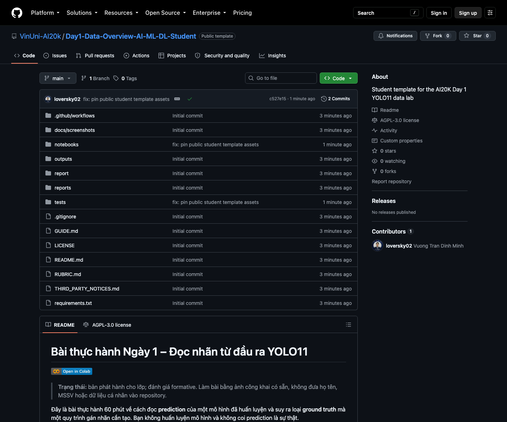
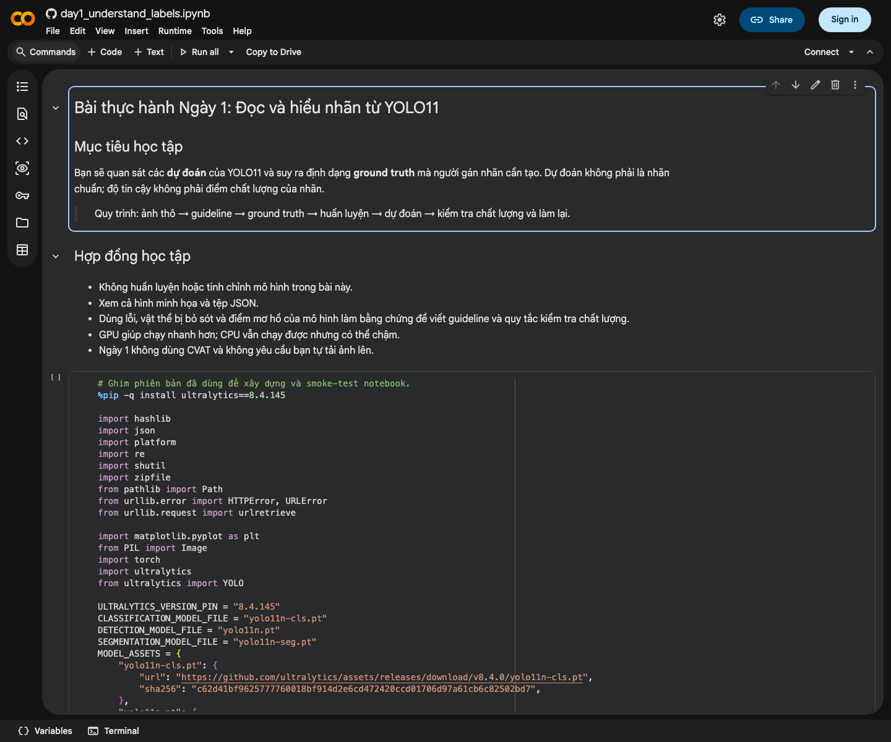

# Bài thực hành Ngày 1 – Đọc nhãn từ đầu ra YOLO11

[](https://colab.research.google.com/github/VinUni-AI20k/Day1-Data-Overview-AI-ML-DL-Student/blob/v1.0.2/notebooks/day1_understand_labels.ipynb)

> **Trạng thái:** bản phát hành cho lớp; đánh giá formative. Tên repository dùng họ tên và MSSV để Lab
> Coach đối chiếu bài nộp; không ghi thêm dữ liệu cá nhân vào báo cáo hoặc output.
> **Phiên bản lớp:** `v1.0.2`; chỉ đổi release giữa khóa khi GV/Lab Lead thông báo chính thức.

Đây là bài thực hành 60 phút về cách đọc **prediction** của một mô hình đã huấn luyện và suy ra loại
**ground truth** mà một quy trình gán nhãn cần tạo. Bạn không huấn luyện mô hình và không coi prediction
là sự thật.

```text
ảnh công khai → model checkpoint → prediction → đối chiếu guideline → ground truth → QC/rework
```

## Phạm vi Ngày 1

- Chạy trên Google Colab; không yêu cầu cài môi trường Python cục bộ.
- Quan sát ba tác vụ: phân loại ảnh, phát hiện vật thể và phân đoạn theo từng đối tượng.
- Đọc JSON, đối chiếu hình minh họa và viết báo cáo có bằng chứng.
- Chỉ dùng ba ảnh COCO công khai đã được notebook cố định và kiểm tra checksum.
- **Không dùng CVAT trong Ngày 1.** Không cài CVAT, không tạo task/job và không nộp annotation CVAT.

## Tương thích Windows, macOS và Ubuntu

Luồng chính chỉ dùng trình duyệt, Google Colab, Google Drive và GitHub Web nên giống nhau trên Windows,
macOS và Ubuntu. Không có lệnh cài đặt hệ thống, đường dẫn ổ đĩa cục bộ hoặc script riêng cho một hệ điều
hành. Chrome và Edge là hai trình duyệt được ưu tiên; Firefox có thể dùng nếu đăng nhập Google/GitHub và
upload cả thư mục hoạt động bình thường.

## Mục tiêu học tập

Sau bài thực hành, bạn có thể:

1. Phân biệt `prediction` với `ground truth` do con người tạo theo guideline.
2. Đọc tên lớp, mã lớp, model score, tọa độ hộp và đa giác mặt nạ.
3. Phân biệt đơn vị nhãn của phân loại ảnh, detection và instance segmentation.
4. Giải thích class list đến từ taxonomy của dữ liệu/checkpoint, không phải do model tự nghĩ ra.
5. Nêu một lỗi hoặc điểm mơ hồ và đề xuất điều annotator/reviewer cần kiểm tra.

## Ba tác vụ

| Tác vụ | Checkpoint | Taxonomy đi kèm checkpoint | Một prediction mô tả |
| --- | --- | --- | --- |
| Phân loại ảnh | `yolo11n-cls.pt` | ImageNet-1K | một lớp được xếp hạng cho toàn ảnh |
| Phát hiện vật thể | `yolo11n.pt` | COCO, 80 lớp | một lớp và một hộp cho mỗi vật thể được phát hiện |
| Phân đoạn đối tượng | `yolo11n-seg.pt` | COCO, 80 lớp | một lớp, hộp và đa giác cho mỗi instance |

Ba taxonomy/định dạng trên là ví dụ công khai để học cách đọc dữ liệu. Chúng không phải taxonomy hoặc
guideline nội bộ của VinFast.

## Checklist trước khi bắt đầu

Bạn chưa cần cài Python, VS Code, Antigravity hoặc CVAT cho bài này. Trước giờ lab, kiểm tra đủ các mục:

- [ ] Đăng nhập được tài khoản GitHub và tài khoản Google dùng cho Colab/Drive.
- [ ] Dùng Chrome hoặc Edge phiên bản mới và có kết nối Internet ổn định.
- [ ] Biết mã khóa (`KHOA`, ví dụ `K4`), họ tên không dấu và MSSV để đặt tên repository bài làm.
- [ ] Mở được repository do GV/Lab Coach cung cấp và nhìn thấy nút **Use this template**.
- [ ] Không sử dụng ảnh cá nhân hoặc dữ liệu nội bộ; notebook đã có sẵn ảnh công khai cho bài lab.
- [ ] Biết kênh hỏi hỗ trợ và kênh nộp link repository của lớp.
- [ ] Biết tên repository bắt buộc theo mẫu `<KHOA>-DAY01-HoVaTen-MSSV`; không thêm email, số điện thoại
  hoặc dữ liệu cá nhân khác.

Nếu thiếu tài khoản hoặc không mở được repository, báo Lab Coach trước khi chạy bài.

## Hướng dẫn từng bước

### Bước 1 — Tạo repository bài làm từ template

Mở repository bằng link do GV/Lab Coach cung cấp, nhấn **Use this template → Create a new repository**.
Chọn tài khoản GitHub của bạn làm owner, đặt tên theo mẫu `<KHOA>-DAY01-HoVaTen-MSSV` và chọn **Public** để
Lab Coach mở được link nộp. Thay `<KHOA>` bằng mã khóa của bạn, ví dụ
`K4-DAY01-NguyenVanAn-12345678`. Chỉ lấy branch mặc định `main`. Nếu đã tạo repository cho bài này thì dùng
lại bản đó, không tạo thêm bản sao.



> Xác nhận đúng tên `VinUni-AI20k/Day1-Data-Overview-AI-ML-DL-Student` và nhãn **Public template** như
> ảnh. Sau khi đăng nhập GitHub, nút **Use this template** nằm ở góc trên bên phải, cạnh Fork/Star.
> Repository tạo từ template có lịch sử độc lập và thư mục `report/` sẵn sàng nhận bài. Không chọn
> **Include all branches**.

### Bước 2 — Mở notebook bằng Google Colab

Quay lại README và nhấn badge **Open in Colab** ở đầu trang. Khi notebook mở ra, nhấn **Copy to Drive**
để tạo bản bạn có thể chỉnh sửa. Nếu Google yêu cầu, đăng nhập và cho phép Colab tạo bản sao trong Drive.



> Bạn có thể chạy bằng CPU. Nếu Colab cấp GPU, chọn `Runtime → Change runtime type → T4 GPU`; không có
> GPU không phải là lỗi của bài lab.

### Bước 3 — Chạy notebook từ trên xuống dưới

Nhấn **Run all** hoặc chạy lần lượt từng ô bằng nút `▶`. Không bỏ qua ô cài đặt, tải dữ liệu, kiểm tra
checksum hoặc kiểm tra bằng chứng ở cuối. Nếu runtime bị ngắt giữa chừng, kết nối lại rồi chạy lại từ đầu.

### Bước 4 — Đọc kết quả và hoàn thành báo cáo

Trong panel **Files** bên trái Colab, mở các tệp JSON và PNG trong `day1_lab_outputs/`. Notebook tạo sẵn
`REPORT.md`; mở tệp này, trả lời bằng bằng chứng từ cả ba tác vụ và tự đối chiếu
[rubric formative](RUBRIC.md). Prediction của model không phải ground truth.

### Bước 5 — Tạo một ZIP trong Google Drive

Ở ô cuối, thay `KHOA` bằng mã khóa rồi chạy ô. Chọn tài khoản Google và cho phép notebook kết nối Drive.
Chỉ tải tệp `<KHOA>-DAY01-report.zip` đã tạo trong
`MyDrive/AI20K-Day1/`; không cần tải riêng từng JSON hoặc PNG.

### Bước 6 — Đưa bài vào `report/` của repository

Giải nén ZIP trên máy. Trong repository tạo từ template, thư mục `report/` phải nhận trực tiếp hai mục
`REPORT.md` và `day1_lab_outputs/`; không đưa nguyên ZIP và không giữ thêm thư mục bọc
`<KHOA>-DAY01-.../`.

- **Windows:** nhấp phải ZIP → **Extract All…** → mở thư mục vừa giải nén.
- **macOS:** nhấp đúp ZIP trong Finder → mở thư mục cùng tên vừa tạo.
- **Ubuntu:** nhấp phải ZIP → **Extract Here** (hoặc mở bằng Archive Manager) → mở thư mục vừa giải nén.

Trên cả ba hệ điều hành, dùng GitHub Web ở bước tiếp theo; không cần mở terminal.

### Bước 7 — Commit, push và nộp link

Chọn một trong hai cách:

- **GitHub Web — phù hợp Ngày 1:** mở thư mục `report/` trong repository của bạn →
  **Add file → Upload files** → kéo
  `REPORT.md` và cả thư mục `day1_lab_outputs/` vào vùng upload → chọn **Commit changes**.
- **Git — nếu đã quen VS Code/terminal:** chạy ba lệnh ở phần [Cấu trúc bài nộp](#cấu-trúc-bài-nộp).

Cuối cùng, tải lại trang GitHub, mở `report/` để kiểm tra đủ file rồi nộp **link repository bài làm** trên
VLearn. Lab Coach đối chiếu tài khoản VLearn với `HoVaTen-MSSV` trong tên repository. Không thêm họ tên,
MSSV vào tên ZIP, `REPORT.md` hoặc output.

Colab miễn phí không bảo đảm GPU hoặc giới hạn tài nguyên cố định. Bản lab dùng biến thể `n` để giảm thời
gian tải/chạy trong lớp; cả ba tác vụ và cấu trúc prediction cần học vẫn giữ nguyên. Không tự đổi checkpoint,
threshold hay mã nguồn; nếu có thay đổi theo hướng dẫn của GV, ghi lại trong báo cáo.

## Từ Colab đến thư mục `report/`

Ô cuối notebook dùng lệnh chính thức của Colab để mở Drive:

```python
from google.colab import drive
drive.mount("/content/drive")
```

Sau khi bạn cho phép truy cập, notebook gom `REPORT.md` và toàn bộ `day1_lab_outputs/`, kiểm tra lại cấu
trúc ZIP, rồi lưu vào:

```text
MyDrive/AI20K-Day1/<KHOA>-DAY01-report.zip
```

Tải **một tệp ZIP này** từ Google Drive và giải nén. ZIP chứa trực tiếp hai mục sau, không có thêm thư mục
bọc bên ngoài:

```text
REPORT.md
day1_lab_outputs/
```

Chép cả hai mục vào `report/` của repository tạo từ template. Không chép nguyên file ZIP vào repo và không chép riêng
từng JSON/PNG từ panel Files của Colab.

## Cấu trúc bài nộp

Tên repository dùng mẫu `<KHOA>-DAY01-HoVaTen-MSSV`; tên ZIP dùng `<KHOA>-DAY01-report.zip`; thư mục nhận
bài luôn là `report/`. Họ tên và MSSV chỉ xuất hiện trong tên repository để đối chiếu với tài khoản VLearn.
Không ghi chúng vào `REPORT.md`, JSON, PNG, attribution hoặc ZIP và không thêm email, số điện thoại hay dữ
liệu cá nhân khác.

```text
<KHOA>-DAY01-HoVaTen-MSSV/
└── report/
    ├── REPORT.md
    └── day1_lab_outputs/
        ├── IMAGE_ATTRIBUTION.md
        ├── classification_predictions.json
        ├── detection_predictions.json
        ├── segmentation_predictions.json
        └── visuals/
            ├── classification_top5.png
            ├── detection_predictions.png
            └── segmentation_prediction.png
```

Ví dụ repository: `K4-DAY01-NguyenVanAn-12345678`. Ví dụ ZIP: `K4-DAY01-report.zip`. Sau khi giải nén,
`report/` phải có cấu trúc như trên.
Nếu VLearn quy định khóa/prefix hoặc kênh nộp khác, ưu tiên yêu cầu chính thức.

Lệnh Git tối thiểu sau khi đã chép đúng nội dung:

```bash
git add report
git commit -m "submit day 1 report"
git push
```

## Lỗi thường gặp

| Hiện tượng | Cách xử lý |
| --- | --- |
| Notebook chỉ xem được, không sửa hoặc lưu được | Đăng nhập Google rồi nhấn **Copy to Drive**. Làm bài trên bản sao trong Drive của bạn. |
| Không có GPU hoặc Colab báo hết GPU | Tiếp tục bằng CPU. Không tự đổi checkpoint; bài dùng model `n` để vẫn chạy được trên CPU. |
| Ô sau lỗi vì thiếu package/biến/file | Chọn `Runtime → Restart session`, sau đó **Run all** từ đầu; không chỉ chạy lại riêng ô đang lỗi. |
| Tải ảnh/model lỗi hoặc báo sai checksum | Kiểm tra Internet, restart session và chạy lại. Không xóa hoặc bỏ qua bước checksum. |
| Runtime bị ngắt hoặc mất kết nối | Nhấn **Reconnect**, sau đó chạy lại notebook từ đầu để tránh output cũ/thiếu. |
| Không thấy `REPORT.md` hoặc `day1_lab_outputs/` | Chạy lại từ đầu và đọc lỗi ở ô kiểm tra bằng chứng. Không tự tạo file rỗng để thay thế. |
| Không thấy ZIP trong Google Drive | Kiểm tra đã chạy ô cuối, đã cấp quyền Drive và đã thay đúng `KHOA`; sau đó mở `MyDrive/AI20K-Day1/`. |
| ZIP có thêm thư mục bọc hoặc thiếu file | Không tự đóng gói lại. Chạy lại ô cuối của notebook và dùng đúng ZIP notebook vừa tạo. |
| GitHub chỉ có file ZIP, không thấy các file báo cáo | Xóa ZIP khỏi thay đổi chưa commit, giải nén rồi đưa trực tiếp `REPORT.md` và `day1_lab_outputs/` vào `report/`. |
| Không upload được thư mục qua GitHub Web | Mở đúng `report/`, kéo thả cả thư mục vào vùng upload. Nếu trình duyệt vẫn chặn, dùng Git hoặc nhờ Lab Coach hỗ trợ. |
| `git push` bị từ chối quyền | Kiểm tra remote đang trỏ tới repository tạo từ template thuộc tài khoản của bạn; đăng nhập lại GitHub nếu cần. |
| Lỡ đưa dữ liệu cá nhân vào báo cáo/output | Giữ định danh bắt buộc ở tên repository, xóa dữ liệu cá nhân khỏi `REPORT.md` và output trước khi nộp link; nếu đã push, báo GV/Lab Coach. |

Nếu lỗi không có trong bảng, chụp màn hình **toàn bộ thông báo lỗi**, ghi rõ bước đang làm và gửi cho Lab
Coach. Không gửi password, token GitHub hoặc mã xác thực Google.

## Quy tắc quan trọng

- `score`/`confidence` là model score dùng để xếp hạng hoặc lọc prediction; không phải điểm chất lượng của
  ground truth và không tự chứng minh prediction đúng.
- `bbox_xyxy` dùng tọa độ pixel `[x_min, y_min, x_max, y_max]`, gốc `(0, 0)` ở góc trên trái.
- `polygon_xy` là các điểm pixel mô tả biên một instance; `instance_id` chỉ nhận diện instance trong bộ
  output của bài lab, không phải class ID hay tracking ID.
- Không sửa nhãn để làm model “đúng”. Hãy ghi nhận sai class, box/mask lệch hoặc vật thể bị bỏ sót.
- Không tải ảnh cá nhân, khuôn mặt, biển số, dữ liệu khách hàng hoặc dữ liệu nội bộ lên Colab/GitHub công khai.
- Ghi mọi thay đổi về checkpoint, package, threshold và môi trường chạy trong `REPORT.md`.

## Tệp trong repository

| Tệp | Dùng để làm gì |
| --- | --- |
| `notebooks/day1_understand_labels.ipynb` | chạy ba tác vụ, tạo evidence và đóng gói bài nộp lên Drive |
| `GUIDE.md` | đọc output và xử lý lỗi thường gặp |
| `reports/REPORT_TEMPLATE.md` | mẫu báo cáo cá nhân |
| `report/` | thư mục học viên đưa nội dung ZIP vào rồi commit/push |
| `RUBRIC.md` | tự kiểm tra formative; không phải ngưỡng đạt chính thức |
| `requirements.txt` | phiên bản Ultralytics đã ghim cho lần phát hành này |
| `tests/test_repository_contract.py` | kiểm tra tên tệp và hợp đồng notebook |

## Nguồn kỹ thuật

- [Ultralytics YOLO11](https://docs.ultralytics.com/models/yolo11/)
- [Ultralytics Predict mode](https://docs.ultralytics.com/modes/predict/)
- [COCO Terms of Use](https://cocodataset.org/#termsofuse)
- [Google Colab FAQ](https://research.google.com/colaboratory/faq.html)

Ba ảnh mẫu dùng trong bản này đều có metadata CC BY 2.0 và notebook tạo `IMAGE_ATTRIBUTION.md` đi kèm
output. Mã nguồn và tài liệu do repository sở hữu được phát hành theo
[AGPL-3.0-only](LICENSE); thành phần bên thứ ba giữ nguyên license riêng trong
[third-party notice](THIRD_PARTY_NOTICES.md). Repository này không tuyên bố phù hợp tiêu chuẩn ISO hoặc
quy trình production của VinFast.
